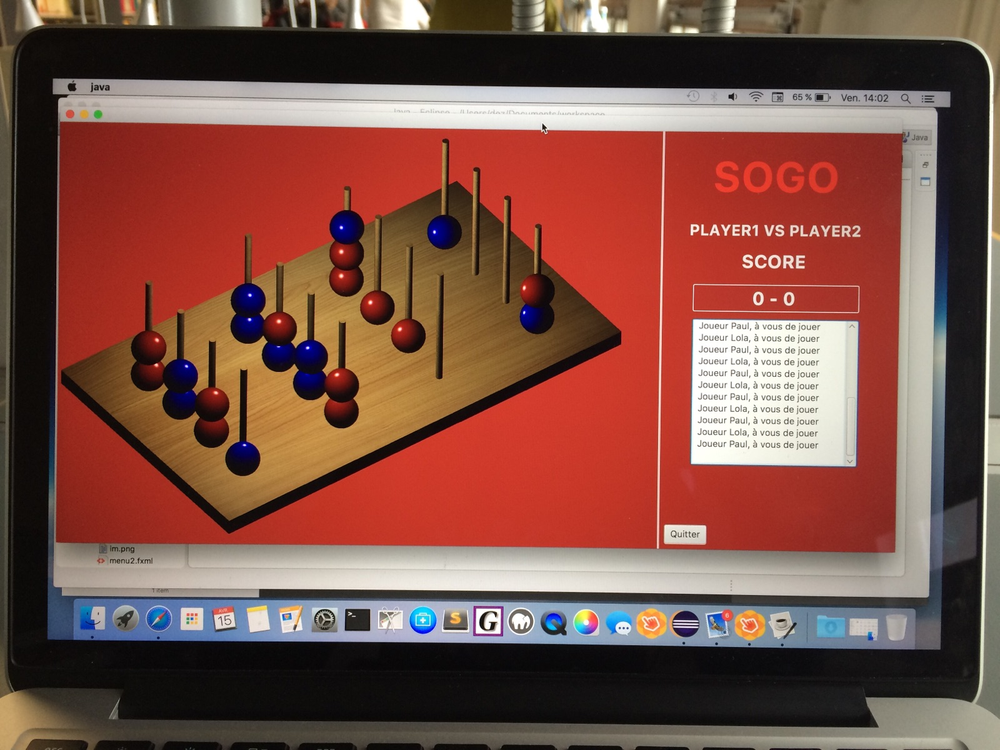

# 2016-Sogo-Puissance-4-3D-

Projet réalisé par :

* Desse Kande

* Jennifer Da Mata Tinoco

* Etienne Juan-Gesta

* Guillaume Lictevout

Dans le cadre de notre 2ème année de licence informatique à Paris 7 Diderot.

Les fichiers se trouvent dans trunk/Interface/src/application

J'ai travaillé sur l'IA principalement.

Le projet repose sur une version antérieure de JavaFX, je n'ai pas réussi à le relancer ni à corriger les erreurs, ne connaissant pas JavaFX et n'ayant pas travaillé sur la partie graphique du projet.

